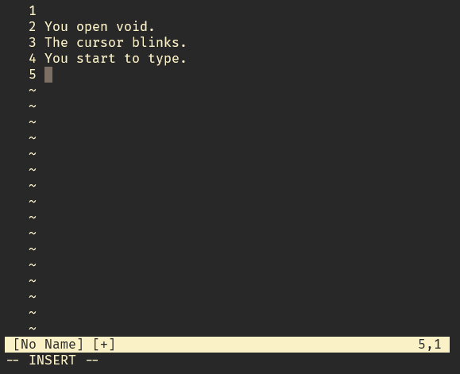

<div align="center">

# Void
**A simple, minimal, Vim-like text editor written in C.**




</div>

## Features

- **Two modes**: Normal mode and Insert mode
- **Line numbers**: Shows line numbers like Vim
- **Arrow key navigation**: Works in both modes
- **Basic editing**: Insert, delete, and save text
- **File operations**: Open, save, and quit
- **Vim-style commands**: Use `:w`, `:q`, `:wq` commands

## Building

### With Make

```bash
make
```

This creates the `void` executable in the `bin/` directory.

### With Anvil

If you have [Anvil](https://github.com/dexter-xD/Anvil) build system installed, you can build using the `void.conf` file:

```bash

# build
anvil void.conf
cd build && make run

# or watch mode (auto-rebuild on file changes)
anvil -w void.conf

# or watch & run mode (auto-rebuild and execute)
anvil -w void.conf

```

The configuration is already set up in `void.conf` for easy building.

## Usage

Open an existing file:
```bash
./bin/void myfile.txt
```

Create a new file:
```bash
./bin/void newfile.txt
```

## Key Bindings

### Normal Mode
- `i` - Enter insert mode
- `o` - Open new line below and enter insert mode
- `x` - Delete character under cursor
- `:` - Enter command mode
- Arrow keys - Move cursor

### Insert Mode
- `ESC` - Return to normal mode
- `Backspace` - Delete previous character
- `Enter` - New line
- Arrow keys - Move cursor

### Commands
- `:w` - Save file
- `:q` - Quit (only if no unsaved changes)
- `:q!` - Quit without saving
- `:wq` - Save and quit
- `:w filename` - Save as filename

## Installation

Install to `/usr/local/bin`:
```bash
sudo make install
```

Then run from anywhere:
```bash
void myfile.txt
```

Uninstall:
```bash
sudo make uninstall
```

## Requirements

- GCC compiler
- Linux/Unix terminal
- Standard C library

## Cleaning

Remove build files:
```bash
make clean
```

## License

Free to use and modify.
